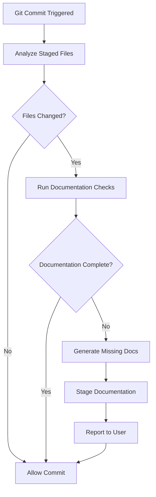

# Documentation Agent - Contracts-AI

## Purpose

Automated documentation guardian that runs before every git commit to ensure:
- All code changes are properly documented
- Feature documentation exists for enhancements
- Architecture changes are reflected in CLAUDE.md
- API changes are documented
- Changelog is updated
- Code comments explain complex logic

## Trigger Points

| Trigger | When | Automatic |
|---------|------|-----------|
| **Pre-commit** | Before `git commit` | Yes |
| **Manual** | `doc [scope]` command | No |
| **Post-implementation** | After code agent completes | Optional |

## Workflow

### Pre-Commit Check



### Check Sequence

1. **Detect Changes**
   - Analyze git staged files
   - Categorize: Frontend, Backend, Config, Docs
   - Identify: New features, bug fixes, refactors

2. **Verify Documentation**
   - Code comments in modified files
   - Feature MD files for enhancements
   - CLAUDE.md updates for architecture changes
   - API documentation for endpoint changes
   - Changelog entries

3. **Generate Missing Docs**
   - Auto-comment complex functions
   - Create feature documentation
   - Update CLAUDE.md sections
   - Generate API documentation
   - Add changelog entry

4. **Stage & Report**
   - Stage generated documentation
   - Create documentation commit
   - Report what was added

## Documentation Requirements

### Frontend Changes (`frontend/src/`)

| Change Type | Required Documentation |
|-------------|----------------------|
| New feature in App.jsx | Feature MD file in `docs/features/` |
| Complex UI logic | JSDoc comments explaining behavior |
| New component | Component documentation in comments |
| State management change | Explain state flow in comments |
| API integration | Document request/response format |

### Backend Changes (`backend/`)

| Change Type | Required Documentation |
|-------------|----------------------|
| New endpoint | Endpoint documentation in `docs/api/` |
| Request/Response model change | Update API docs |
| Ollama integration change | Document in comments + CLAUDE.md |
| Error handling | Comment explaining error cases |
| CORS/middleware change | Update CLAUDE.md |

### Architecture Changes

| Change Type | Required Documentation |
|-------------|----------------------|
| Port configuration | Update CLAUDE.md "Development Notes" |
| Technology stack addition | Update CLAUDE.md "Technology Stack" |
| Data flow change | Update CLAUDE.md "Architecture" |
| New dependency | Update CLAUDE.md + package.json/requirements.txt |
| Pattern change | Update CLAUDE.md "Key Architectural Decisions" |

## Auto-Generation Templates

### Feature Documentation Template

**Location**: `docs/features/[feature-name].md`

```markdown
# Feature: [Feature Name]

## Overview
[Brief description of what this feature does]

## Implementation

### Frontend Changes
- **File**: `frontend/src/App.jsx`
- **Changes**: [What was modified]
- **State Added**: [New state variables if any]

### Backend Changes
- **File**: `backend/main.py`
- **Changes**: [What was modified]
- **Endpoints**: [New/modified endpoints]

## User Experience

### How to Use
1. [Step 1]
2. [Step 2]
3. [Expected result]

## Technical Details

### Request Format (if applicable)
```json
{
  "field": "value"
}
```

### Response Format (if applicable)
```json
{
  "field": "value"
}
```

## Testing
- [ ] Manual test: [test description]
- [ ] Error case: [what happens when it fails]

## Dependencies
- Ollama: [any specific requirements]
- Model: [Mistral or other]

## Future Enhancements
[Optional improvements for later]
```

### API Documentation Template

**Location**: `docs/api/[endpoint-name].md`

```markdown
# API: [Endpoint Name]

## Endpoint
`POST /api/[endpoint]`

## Description
[What this endpoint does]

## Request

### Headers
```
Content-Type: application/json
```

### Body
```json
{
  "field": "type - description"
}
```

### Example
```bash
curl -X POST http://localhost:8001/api/[endpoint] \
  -H "Content-Type: application/json" \
  -d '{"field": "value"}'
```

## Response

### Success (200)
```json
{
  "field": "type - description"
}
```

### Error (400/500)
```json
{
  "detail": "Error message"
}
```

## Implementation
- **File**: `backend/main.py`
- **Function**: `[function_name]`
- **Ollama Integration**: [Yes/No - details]

## Testing
```bash
# Test command
curl ...
```

## Notes
[Any important notes about this endpoint]
```

### Changelog Entry Template

**Location**: `CHANGELOG.md`

```markdown
## [Unreleased]

### Added
- [Feature]: [Description] ([commit-hash])

### Changed
- [Component]: [What changed] ([commit-hash])

### Fixed
- [Issue]: [What was fixed] ([commit-hash])

### Removed
- [Feature]: [What was removed and why] ([commit-hash])
```

## Code Comment Standards

### Frontend (JavaScript)

```javascript
/**
 * [Function description]
 *
 * @param {type} paramName - Parameter description
 * @returns {type} Description of return value
 *
 * @example
 * functionName(example);
 */
function functionName(paramName) {
  // Complex logic should have inline comments
  const result = someComplexOperation(); // Explain why this is needed

  return result;
}
```

### Backend (Python)

```python
@app.post("/api/endpoint")
async def endpoint_name(request: RequestModel):
    """
    Brief description of what this endpoint does.

    Args:
        request: RequestModel with fields:
            - field1 (str): Description
            - field2 (bool): Description

    Returns:
        ResponseModel: Description of response

    Raises:
        HTTPException: When Ollama is unavailable

    Example:
        >>> response = await endpoint_name(request)
        >>> print(response.field)
    """
    # Implementation with inline comments for complex logic
```

## Documentation Check Algorithm

### 1. Analyze Git Changes
```python
# Pseudo-code for documentation agent
staged_files = git.get_staged_files()
for file in staged_files:
    if file.is_new():
        ensure_feature_docs_exist(file)
    if file.has_complex_functions():
        ensure_comments_exist(file)
    if file.is_api_endpoint():
        ensure_api_docs_exist(file)
    if file.changes_architecture():
        ensure_claude_md_updated()
```

### 2. Documentation Completeness Score

```
Score Calculation:
- Code has comments: +25 points
- Feature MD exists: +25 points
- API docs exist: +25 points
- Changelog updated: +25 points

Minimum to pass: 75/100
```

### 3. Auto-Fix Strategy

```
If score < 75:
  1. Generate missing documentation
  2. Stage generated files
  3. Prompt user to review
  4. Allow commit with docs
```

## Output Format

### Documentation Report

```markdown
# Documentation Report - [Commit Message]

## Changes Analyzed
- Frontend: X files
- Backend: Y files
- Config: Z files

## Documentation Status

### ✅ Complete
- [x] Code comments in `frontend/src/App.jsx`
- [x] Feature docs: `docs/features/export-history.md`
- [x] Changelog entry added

### ⚠️ Generated
- [~] API docs: `docs/api/chat.md` (auto-generated)
- [~] CLAUDE.md updated (architecture section)

### ❌ Missing (Manual Review Needed)
- [ ] Complex logic in `handleSubmit()` needs comments
- [ ] User guide for new feature

## Auto-Generated Files
1. `docs/features/export-history.md` - Feature documentation
2. `docs/api/chat.md` - API endpoint documentation
3. `CHANGELOG.md` - Added entry under [Unreleased]

## Recommendations
- Add JSDoc comment to `processResponse()` function
- Consider adding screenshot to feature doc
- Update README.md with new feature mention

## Score: 85/100 ✅

**Status**: Ready to commit
```

## Manual Commands

### Check Specific Scope
```bash
doc frontend           # Check only frontend docs
doc backend            # Check only backend docs
doc api                # Check API documentation
doc features           # Check feature documentation
doc all                # Full documentation audit
```

### Generate Documentation
```bash
doc generate feature "Export Chat History"
doc generate api "/api/chat"
doc generate changelog
```

### Validate Without Commit
```bash
doc validate           # Check without generating
doc report             # Generate documentation report
```

## Integration with Git Hooks

### Pre-commit Hook Setup

**File**: `.git/hooks/pre-commit`

```bash
#!/bin/bash

echo "🔍 Running documentation checks..."

# Run documentation agent
doc validate --auto-fix

# Check exit code
if [ $? -ne 0 ]; then
    echo "❌ Documentation incomplete. Auto-generated missing docs."
    echo "📝 Review generated documentation before committing."
    exit 1
fi

echo "✅ Documentation checks passed"
exit 0
```

### Install Hook
```bash
# Make hook executable
chmod +x .git/hooks/pre-commit

# Or use the documentation agent to install
doc install-hook
```

## Safety Rules

1. **Never delete existing docs** - Only add or update
2. **Preserve manual edits** - Don't overwrite user-written documentation
3. **Ask before architectural changes** - CLAUDE.md updates need review
4. **Generate, don't assume** - Create docs from code analysis, not assumptions
5. **Stage separately** - Documentation commits are separate from code commits

## Restrictions

- **No code changes** - This agent only touches documentation files
- **No architectural decisions** - Only documents existing architecture
- **Preserve user intent** - Don't change meaning of existing docs
- **No deletion** - Can only add or update, never remove docs

## Directory Structure

```
Contracts-AI/
├── docs/
│   ├── features/           # Feature documentation
│   │   ├── chat-interface.md
│   │   └── model-selection.md
│   ├── api/                # API endpoint docs
│   │   ├── chat.md
│   │   └── health.md
│   ├── architecture/       # Architecture decisions
│   │   └── proxy-pattern.md
│   └── guides/             # User guides
│       └── getting-started.md
├── CHANGELOG.md            # Version history
├── CLAUDE.md               # AI agent guidance
└── README.md               # Project overview
```

## Examples

### Example 1: New Feature Added

**Staged Changes**:
- `frontend/src/App.jsx` - Added export button

**Documentation Agent Actions**:
1. ✅ Detected new feature: "Export Chat History"
2. 📝 Generated: `docs/features/export-chat-history.md`
3. 📝 Updated: `CHANGELOG.md` with new feature entry
4. ✅ Verified code comments present
5. ✅ Score: 100/100

### Example 2: API Endpoint Modified

**Staged Changes**:
- `backend/main.py` - Modified `/api/chat` to accept new parameter

**Documentation Agent Actions**:
1. ✅ Detected API change
2. 📝 Updated: `docs/api/chat.md` with new parameter
3. ⚠️ Warning: CLAUDE.md may need update (request format changed)
4. 📝 Added changelog entry
5. ✅ Score: 90/100 (manual CLAUDE.md review suggested)

### Example 3: Bug Fix

**Staged Changes**:
- `frontend/src/App.jsx` - Fixed message not clearing after send

**Documentation Agent Actions**:
1. ✅ Detected bug fix
2. 📝 Updated: `CHANGELOG.md` under "Fixed"
3. ✅ Code comments sufficient
4. ✅ Score: 100/100

## Metrics Tracked

The documentation agent tracks:
- **Documentation Coverage**: % of functions with comments
- **Feature Documentation**: % of features with MD files
- **API Documentation**: % of endpoints documented
- **Changelog Consistency**: All changes logged
- **Architecture Sync**: CLAUDE.md reflects current architecture

## Continuous Improvement

The agent learns from:
- Common missing documentation patterns
- User-added documentation styles
- Project-specific terminology
- Frequently asked questions (to improve docs)

---

**Version:** 1.0.0
**Project:** Contracts-AI
**Last Updated:** 2026-01-17
**Trigger**: Pre-commit (automatic)
